# DSO101 Assignment 1 - Containerisation & CI/CD Pipeline

> **Course:** DSO101 — Continuous Integration and Continuous Deployment  
> **Programme:** Bachelor of Engineering in Software Engineering (SWE)  

---

## Table of Contents

1. [Overview](#overview)
2. [Tech Stack](#tech-stack)
3. [Project Structure](#project-structure)
4. [Environment Variables](#environment-variables)
5. [Running Locally](#running-locally)
6. [Part A - Docker Hub & Render Deployment](#part-a--docker-hub--render-deployment)
7. [Part B - Automated Git-Based Deployment (Blueprint)](#part-b--automated-git-based-deployment-blueprint)
8. [Assignment 2: Jenkins CI/CD Pipeline](#assignment-2-jenkins-cicd-pipeline)

---

## Overview

A full-stack **Todo List** web application built to demonstrate containerisation and CI/CD principles. The application supports creating, editing, completing, and deleting tasks, backed by a persistent PostgreSQL database.

| Component | Responsibility |
|-----------|---------------|
| **Frontend** | React SPA — task UI (add / edit / delete / complete) |
| **Backend**  | Node.js/Express REST API with full CRUD endpoints |
| **Database** | PostgreSQL — persistent task storage |

---

## Tech Stack

| Layer    | Technology              |
|----------|-------------------------|
| Frontend | React 18, Axios         |
| Backend  | Node.js 18, Express     |
| Database | PostgreSQL 15           |
| Serving  | Nginx (frontend container) |
| Registry | Docker Hub              |
| Hosting  | Render.com              |

---

## Project Structure

```
studentname_sudentnumber_DSO101_A1/
├── todo-app/
│   ├── backend/
│   │   ├── server.js          # Express CRUD API
│   │   ├── package.json
│   │   └── Dockerfile
│   └── frontend/
│       ├── src/
│       │   ├── App.js         # React UI
│       │   ├── App.css
│       │   └── index.js
│       ├── public/index.html
│       ├── package.json
│       ├── nginx.conf
│       └── Dockerfile
├── render.yaml                # Render Blueprint (Part B)
├── docker-compose.yml         # Local multi-service orchestration
├── .gitignore                 # Excludes .env files from version control
└── README.md
```

---

## Environment Variables

Sensitive configuration is **never committed to Git**. Both services consume environment variables at runtime.

### Backend (`.env`)

```env
DB_HOST=<your-render-db-internal-host>
DB_USER=<your-db-user>
DB_PASSWORD=<your-db-password>
DB_NAME=<your-db-name>
DB_PORT=5432
DB_SSL=true
PORT=5000
```

### Frontend (`.env`)

```env
REACT_APP_API_URL=http://localhost:5000
```

> ⚠️ **Never commit `.env` files to version control.** They are listed in `.gitignore`. On Render, all secrets are injected via the dashboard's **Environment Variables** panel, not stored in code.

---

## Running Locally

### Option A - Docker Compose *(recommended)*

```bash
docker-compose up --build
```

| Service  | Local URL              |
|----------|------------------------|
| Frontend | http://localhost:3000  |
| Backend  | http://localhost:5000  |
| Database | localhost:5432         |

### Option B - Manual (without Docker)

```bash
# 1. Start the backend
cd todo-app/backend
cp .env.example .env   # fill in your local DB credentials
npm install
npm start

# 2. Start the frontend (separate terminal)
cd todo-app/frontend
cp .env.example .env   # set REACT_APP_API_URL=http://localhost:5000
npm install
npm start
```

---

## Part A - Docker Hub & Render Deployment

### Step 1 - Build and Push Docker Images

Multi-platform images are built for `linux/amd64` to ensure compatibility with Render's infrastructure.

```bash
# Build and push the backend image
docker buildx build \
  --platform linux/amd64 \
  -t sevenkels/be-todo:02230285 \
  --push \
  ./todo-app/backend

# Build and push the frontend image
# The backend URL is injected at build time via --build-arg
docker buildx build \
  --platform linux/amd64 \
  --build-arg REACT_APP_API_URL=https://be-todo-ppwq.onrender.com \
  -t sevenkels/fe-todo:02230285 \
  --push \
  ./todo-app/frontend
```

The student ID `02230285` is used as the image tag as required by the assignment.

### Step 2 - Docker Hub Images

Both images are publicly available on Docker Hub.

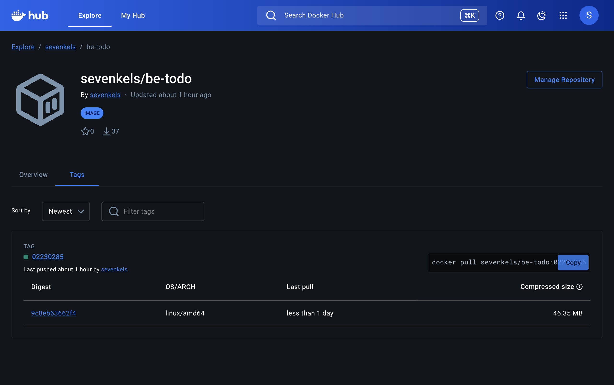

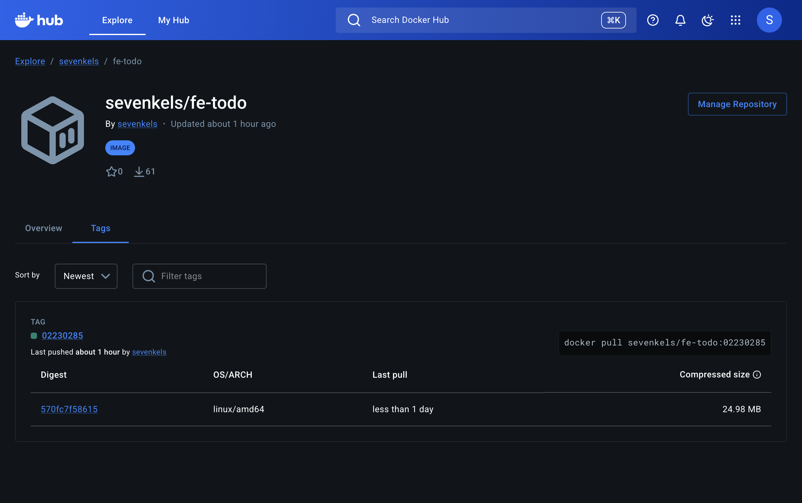

### Step 3 - Provision PostgreSQL on Render

A managed PostgreSQL database is created through the Render dashboard. The internal connection credentials are then copied into the backend service's environment variable configuration — they are **not stored in this repository**.

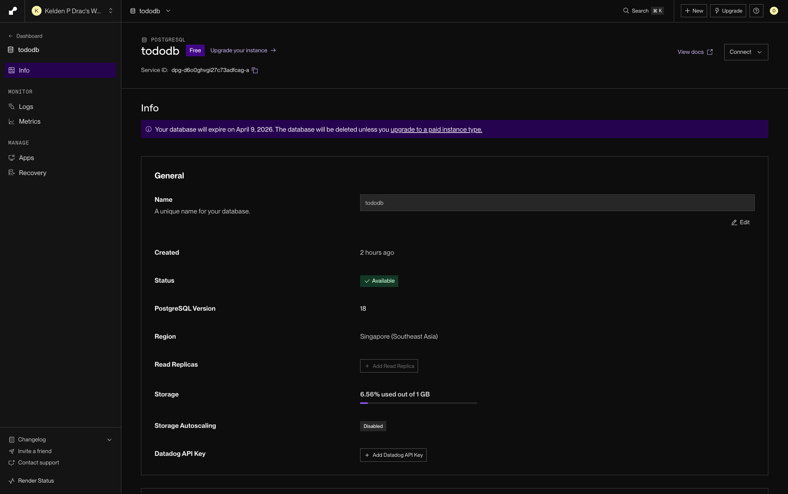

### Step 4 - Deploy Backend Web Service on Render

A new **Web Service** is created using the **"Existing image from Docker Hub"** option.

- **Image:** `docker.io/sevenkels/be-todo:02230285`

The following environment variables are configured securely via the Render dashboard:

| Key           | Description                                      |
|---------------|--------------------------------------------------|
| `DB_HOST`     | Internal hostname provided by Render PostgreSQL  |
| `DB_USER`     | Database user (from Render PostgreSQL dashboard) |
| `DB_PASSWORD` | Database password (from Render PostgreSQL dashboard) |
| `DB_NAME`     | Database name (from Render PostgreSQL dashboard) |
| `DB_PORT`     | `5432`                                           |
| `DB_SSL`      | `true`                                           |
| `PORT`        | `5000`                                           |

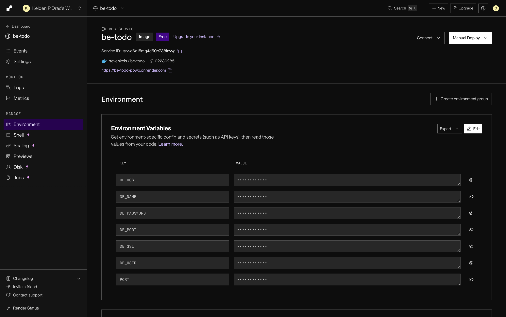

### Step 5 - Deploy Frontend Web Service on Render

A second **Web Service** is created using the frontend image.

- **Image:** `docker.io/sevenkels/fe-todo:02230285`

| Key                 | Description                          |
|---------------------|--------------------------------------|
| `REACT_APP_API_URL` | Public URL of the live backend service |

> **Note:** Because React environment variables are embedded at build time (compile-time), `REACT_APP_API_URL` is injected via `--build-arg` during the `docker build` step. The variable set on Render serves as a reference record only.

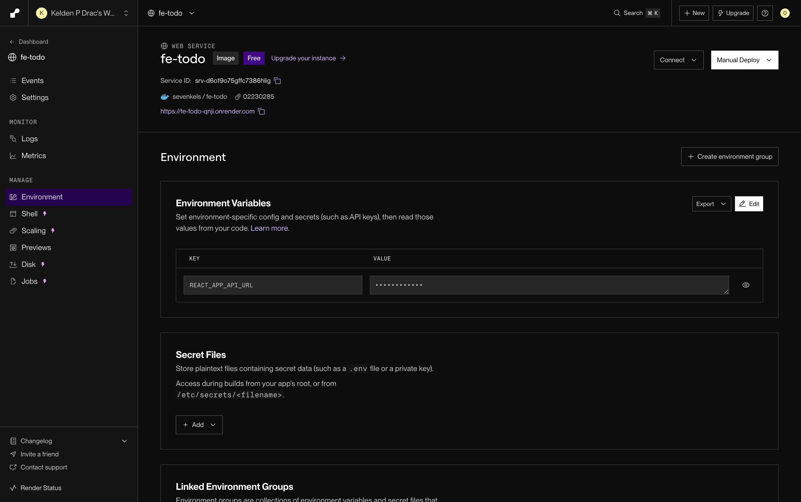

### Step 6 - Live Application

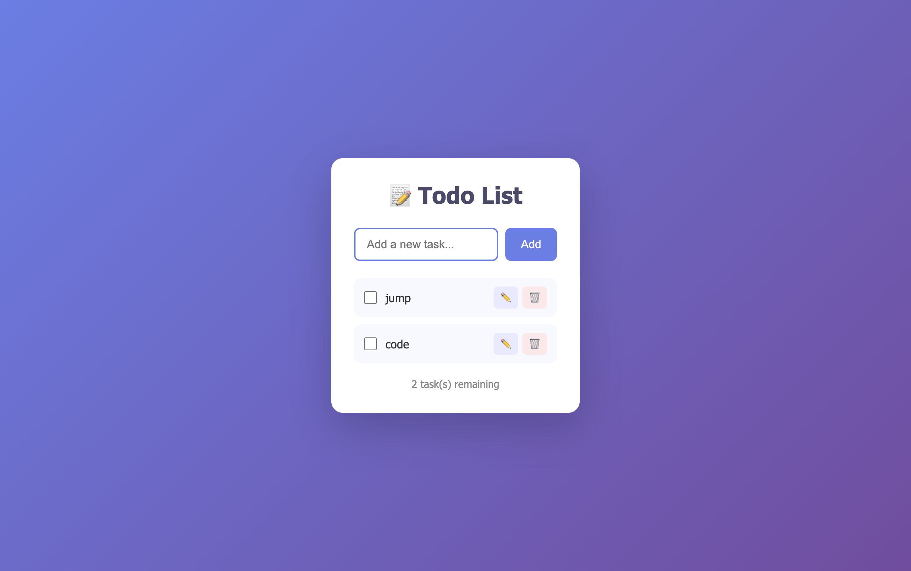

| Service  | Live URL                              |
|----------|---------------------------------------|
| Frontend | https://fe-todo-qnji.onrender.com     |
| Backend  | https://be-todo-ppwq.onrender.com     |

---

## Part B - Automated Git-Based Deployment (Blueprint)

A `render.yaml` Blueprint file at the repository root defines the complete multi-service deployment. Every `git push` to the `main` branch automatically triggers a Blueprint sync and redeploys all services.

### render.yaml (structure overview)

```yaml
services:
  - type: web
    name: be-todo
    runtime: image
    image:
      url: docker.io/sevenkels/be-todo:02230285
    plan: free
    region: singapore
    autoDeploy: true
    envVars:
      - key: DB_HOST
        value: <set via Render dashboard — not stored in repo>
      - key: PORT
        value: 5000
      # Additional DB credentials are set via the Render dashboard

  - type: web
    name: fe-todo
    runtime: image
    image:
      url: docker.io/sevenkels/fe-todo:02230285
    plan: free
    region: singapore
    autoDeploy: true
    envVars:
      - key: REACT_APP_API_URL
        value: https://be-todo-ppwq.onrender.com
```

### Blueprint Setup Steps

1. Push the repository to GitHub.
2. On Render, go to **New - Blueprint**.
3. Connect the GitHub repository — Render automatically detects `render.yaml`.
4. Select **"Associate existing services"** to link to previously created services.
5. Click **"Apply Blueprint"** to finalise the configuration.

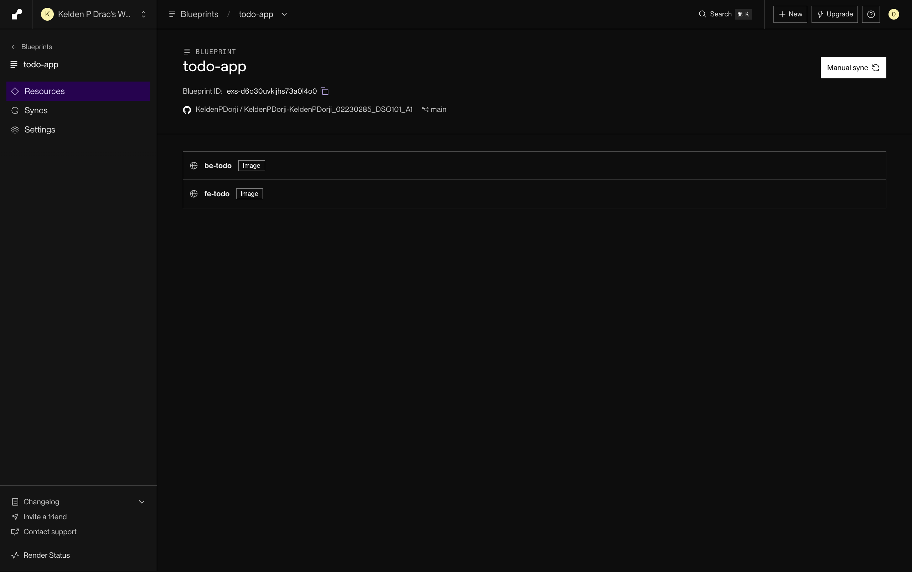

### Continuous Deployment on Git Push

With `autoDeploy: true` set for both services, every commit pushed to `main` triggers an automatic redeploy. The screenshot below shows the deployment log following a `git push`.

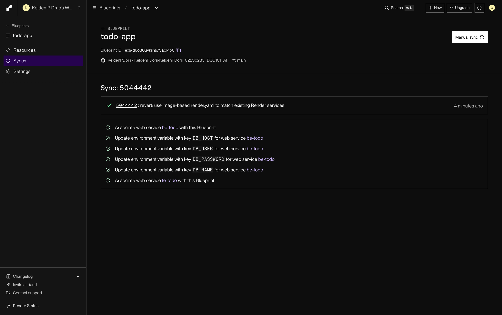

---

## Environment Variables

| Variable            | Service  | Description                 |
|---------------------|----------|-----------------------------|
| `DB_HOST`           | Backend  | PostgreSQL host             |
| `DB_USER`           | Backend  | PostgreSQL username         |
| `DB_PASSWORD`       | Backend  | PostgreSQL password         |
| `DB_NAME`           | Backend  | Database name               |
| `DB_PORT`           | Backend  | PostgreSQL port             |
| `DB_SSL`            | Backend  | Enable SSL (`true`/`false`) |
| `PORT`              | Backend  | Server port                 |
| `REACT_APP_API_URL` | Frontend | Backend API base URL        |

> ⚠️ `.env` files are listed in `.gitignore` and are never committed.

---

## Assignment 2: Jenkins CI/CD Pipeline

### Overview

An automated CI/CD pipeline was configured using Jenkins to build, test, and deploy the Todo List application. The pipeline pulls source code from GitHub, installs dependencies, runs unit tests, builds Docker images, and pushes them to Docker Hub.

### Step 1 - Jenkins Setup & Plugin Configuration

Jenkins was installed via Homebrew on macOS and accessed at `localhost:8080`. Required plugins — NodeJS, Pipeline, GitHub Integration, Docker Pipeline, and JUnit — were installed manually via `.hpi` files due to network restrictions on the university network. Node.js was configured by setting the `PATH` environment variable inside the `Jenkinsfile` to point to the nvm-managed binary.

### Step 2 - GitHub & Docker Hub Credentials

GitHub and Docker Hub credentials were stored securely in Jenkins' credential store using Personal Access Tokens — never hardcoded in any file.

### Step 3 - Pipeline Configuration

A `Jenkinsfile` was created at the repository root using declarative syntax. The pipeline was connected to the GitHub repository via **Pipeline script from SCM**, with the credential ID `github-pat`.

The `Jenkinsfile` defines 8 automated stages:

| Stage | Description |
|-------|-------------|
| **Checkout** | Clones the repository from GitHub using a Personal Access Token |
| **Install Backend Dependencies** | Runs `npm install` for the Node.js backend, including Jest and jest-junit |
| **Install Frontend Dependencies** | Runs `npm install` for the React frontend |
| **Build Frontend** | Produces an optimized production build via `react-scripts build` |
| **Test Backend** | Executes 6 Jest unit tests with JUnit XML reporting for Jenkins |
| **Build Docker Images** | Builds `todo-backend:latest` and `todo-frontend:latest` Docker images |
| **Push to Docker Hub** | Authenticates and pushes both images to `sevenkels` on Docker Hub |
| **Deploy** | Confirms successful deployment with image tags |

### Step 4 - Running the Pipeline

The pipeline was triggered manually via **Build Now** in the Jenkins dashboard.

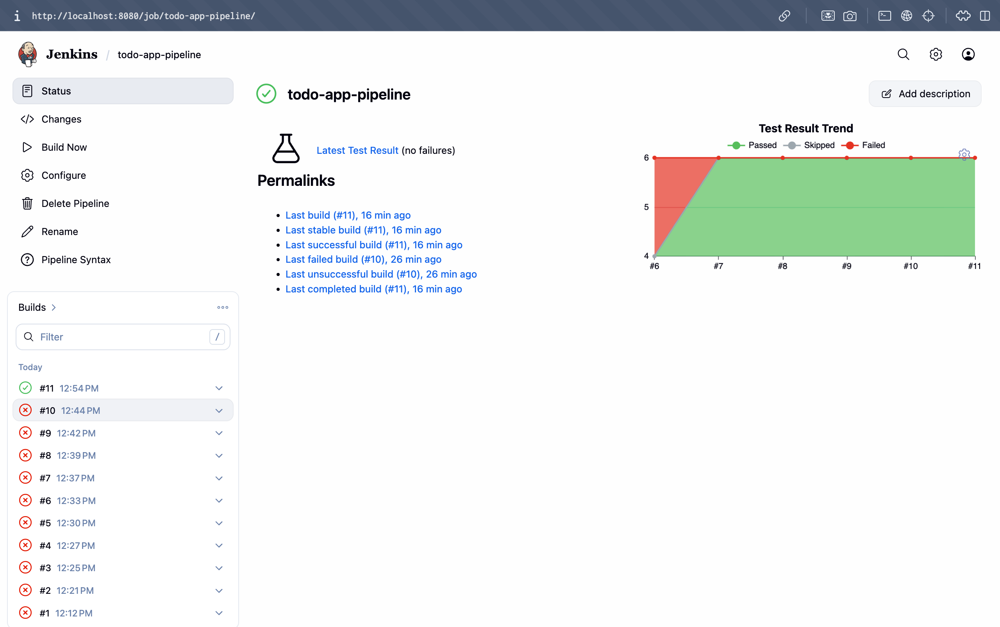

Build #11 completed successfully with all 8 stages passing in 1 minute 13 seconds.

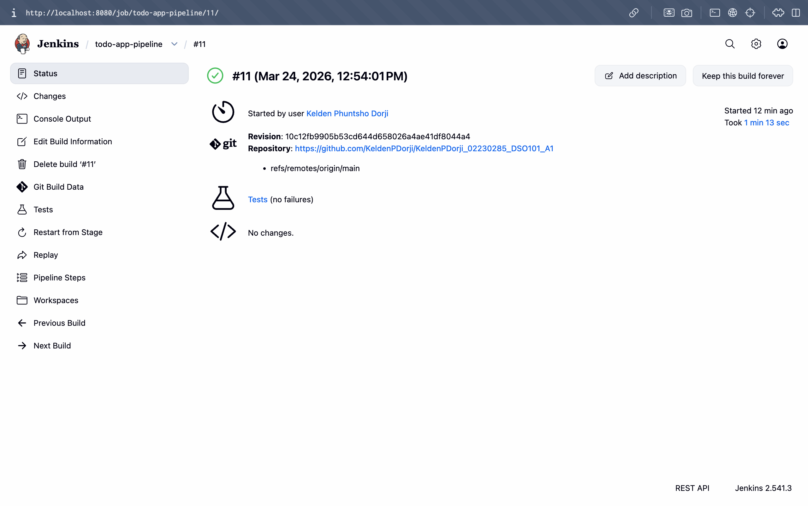

### Step 5 - Test Results

Jest unit tests were run against the backend with JUnit XML reporting, making results visible directly in Jenkins.

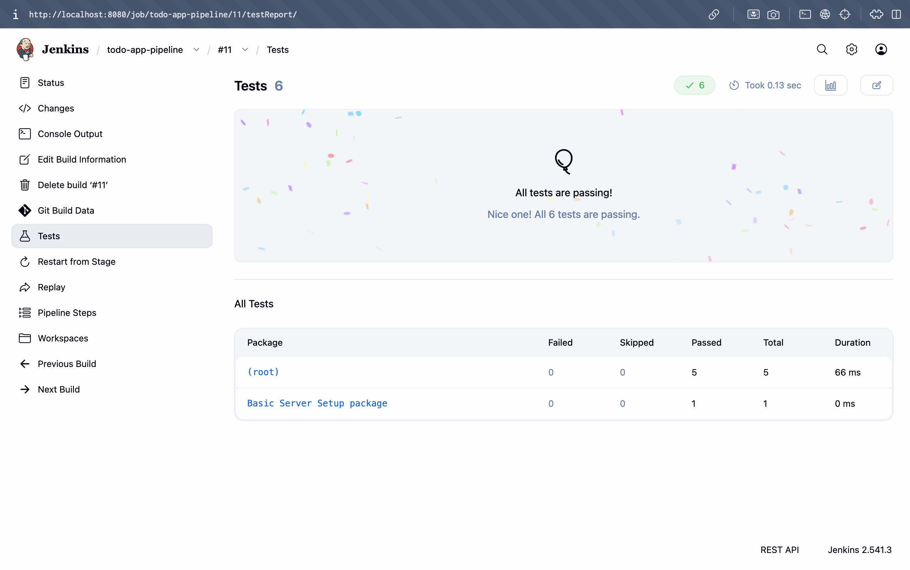

| Metric | Result |
|--------|--------|
| Total Tests | 6 |
| Passed | 6 |
| Failed | 0 |
| Framework | Jest |
| Report Format | JUnit XML |

The console output confirms all stages completed without errors.

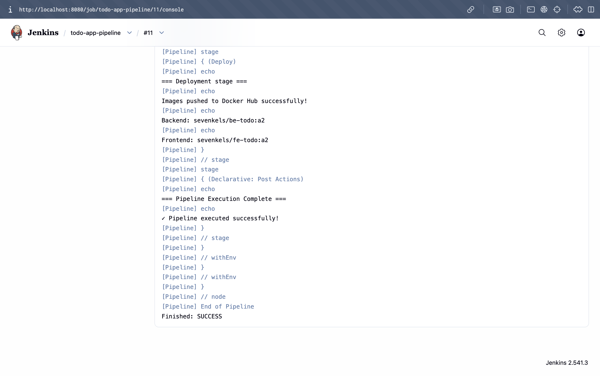

### Step 6 - Docker Hub Deployment

Both images were successfully pushed to the `sevenkels` namespace on Docker Hub under the `a2` tag.

- `sevenkels/be-todo:a2`
- `sevenkels/fe-todo:a2`

### Challenges Faced

- **Plugin installation failures** - The university network blocked Jenkins from downloading plugins from the update centre. This was resolved by downloading `.hpi` files manually via browser and uploading them through the Jenkins UI.
- **Node.js not found** - Jenkins could not locate the `npm` binary because Node.js was installed via `nvm`, which is not loaded in non-interactive shells. This was fixed by explicitly adding the nvm binary path to the `PATH` environment variable in the `Jenkinsfile`.
- **Jest test path error** - The test file referenced `../package.json` but was already inside the `backend` directory. The path was corrected to `./package.json`.
- **Frontend test stage failure** - The React frontend had no test files, causing Jest to exit with code 1. This was resolved by passing the `--passWithNoTests` flag.
- **Docker daemon not running** - The Docker build stage failed because Docker Desktop was not running. Starting Docker Desktop resolved the issue.

---

## Resources

- [Docker Documentation](https://docs.docker.com/)
- [Render Documentation](https://render.com/docs)
- [Render Blueprint Spec](https://render.com/docs/blueprint-spec)
- [Render - Deploy from Docker Hub](https://render.com/docs/deploying-an-image)
- [Jenkins Documentation](https://www.jenkins.io/doc/)
- [Jest Testing Framework](https://jestjs.io/)
